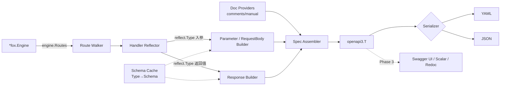

# Fox OpenAPI 自动生成 — 设计文档

> 状态：Phase 2 注释提取已部分实现，Phase 2+ 持续推进
> 版本：v0.3
> 日期：2026-05-04

## 1. 背景与目标

Fox 框架以"约定优于配置"为核心，handler 通过反射自动绑定请求、自动渲染响应。这意味着框架在运行期已经掌握了生成 OpenAPI 3.x spec 所需的几乎全部结构信息：

- 路由路径与 HTTP 方法（来自 `engine.Routes()`）
- 请求参数（来自 handler 入参 struct 的 `json` / `query` / `uri` / `header` / `binding` tag）
- 响应类型（来自 handler 返回值的 `reflect.Type`）
- 错误模型（来自 `httperrors.Error`）

**目标**：

1. 提供一个独立 Go module `github.com/fox-gonic/fox-openapi`，对任意 `*fox.Engine` 在运行期自动生成 OpenAPI 3.0.3 spec（可选升级到 3.1）
2. 对现存 handler **零改造**即可获得基础 spec（路径、方法、参数、请求体、响应类型）
3. 提供一套轻量元数据 API，按需补充 `summary`/`description`/`operationId`/`tags`/`security`/多状态码响应
4. 内置 spec 输出端点（`/openapi.yaml`、`/openapi.json`）
5. 为后续 Swagger UI / Scalar / Redoc 和 `DomainEngine` 多域名场景预留扩展方向

**非目标**：

- 不走 `swag` 注释 DSL 路线；注释提取只读取普通 Go doc comment
- 不做 OpenAPI 2.0 (Swagger) 兼容
- 不替代用户手写 spec 的能力（用户始终可以提供 override）
- 不解决 RPC、GraphQL、gRPC-Gateway 场景

## 2. 设计原则

1. **零侵入优先**：基础 spec 不要求修改任何现存代码，所有元数据补充都是可选的
2. **运行期反射，不做 codegen**：与 fox 既有架构一致；避免引入额外构建步骤
3. **显式优于隐式**：能从代码可靠推断的字段才自动填充；推断不确定时留空，由用户显式声明
4. **可分层覆盖**：自动推断 → 注释元数据 → handler 元数据 → group 元数据 → 全局默认，后者可被前者覆盖
5. **错误优雅降级**：遇到无法反射的类型（`any`、`interface{}`、循环引用）输出 `additionalProperties: true` 并记录警告，不阻断生成

## 3. 架构总览



核心组件职责：

| 组件 | 职责 |
|---|---|
| **Route Walker** | 遍历 `engine.Routes()`，提取 `(method, path, handler)` 三元组 |
| **Handler Reflector** | 解析 handler 签名，定位入参 struct 与返回值 |
| **Schema Cache** | `reflect.Type → *openapi3.SchemaRef` 的全局缓存，用于复用与 `$ref` 引用 |
| **Parameter / RequestBody Builder** | 按 tag 分类字段为 path/query/header 参数或 body schema |
| **Response Builder** | 解析返回类型；从 metadata registry 合并多状态码响应 |
| **Doc Providers** | 按来源补充 operation / schema / field 的描述性元数据 |
| **Spec Assembler** | 拼装 `openapi3.T`，按需引用 components |

## 4. 包结构

```
fox/
├── route_registry.go   // fox core: HandlerRoutes / RouteInfo，仅暴露轻量元信息
└── openapi/
    ├── go.mod          // module github.com/fox-gonic/fox-openapi
    ├── openapi.go      // 主入口：New / Spec / YAML / JSON / WriteYAML / Warnings
    ├── comments.go     // Source option + Go comment extraction
    ├── handler.go      // YAMLHandler / JSONHandler
    └── openapi_test.go
```

当前为了开发方便先放在 fox 仓库内，但 `openapi/` 已经是独立 module，并使用未来独立 repo 的 module path。功能稳定后可直接迁移到单独仓库，删除本地 `replace` 即可。

为什么独立 module：

- 避免主包引入 `kin-openapi` 这一较重依赖
- fox core 只暴露通用 `HandlerRoutes()`，不出现 OpenAPI 生成逻辑
- 未来迁出独立 repo 时，用户 import path 不需要变化

## 5. 核心数据流

### 5.1 反射切入点

handler 已被 `IsValidHandlerFunc` 验证，签名固定为以下五类之一：

```
1. func()
2. func(ctx *Context) T
3. func(ctx *Context) (T, error)
4. func(ctx *Context, args S) T
5. func(ctx *Context, args S) (T, error)
```

OpenAPI 生成只关心：

- **入参定位**：当 `numIn == 2` 时，`handlerType.In(1)` 即业务入参 struct（可能是指针）
- **返回类型定位**：当 `numOut >= 1` 时，`handlerType.Out(0)` 即响应类型；若是 `error` 接口或 `nil`，认为无响应体
- **handler 唯一标识**：用 `runtime.FuncForPC(funcValue.Pointer()).Name()` 作为 `operationId` 默认值

### 5.2 Route Walker

`gin.Engine.Routes()` 返回 `[]gin.RouteInfo{Method, Path, Handler, HandlerFunc}`。但 fox 的 handler 被 `handleWrapper` 包装成 `gin.HandlerFunc`，原 handler 的 `reflect.Value` 已丢失。

**方案**：在 `routergroup.go` 的 `Handle` 中，把原 `handler` 注册到新的 `engine.handlerRoutes` 字典：

```go
type RouteInfo struct {
    Method      string
    Path        string
    Handler     HandlerFunc
    HandlerType reflect.Type
    HandlerName string
}

func (engine *Engine) HandlerRoutes() []RouteInfo
```

这是对主包的**唯一侵入式改动**。`handlerRoutes` 默认开启，只记录轻量的路由与原始 handler 信息，不引入 `fox-openapi` 依赖；如用户极度关注内存，可通过后续配置关闭采集。

路径转换规则：

- gin path `:id` 转换为 OpenAPI path `{id}`，如 `/users/:id` → `/users/{id}`
- `uri:"id"` 字段必须能匹配路径参数 `{id}`，不一致时生成 warning
- 当 handler 没有对应 `uri` 入参时，从路由占位符补充 `string` 类型 path parameter
- gin wildcard `*filepath` 转换为 `{filepath}`；`x-fox-wildcard` 标记放入后续扩展

### 5.3 入参字段分类

对入参 struct 的每个字段：

| Tag 优先级 | 归属 | 备注 |
|---|---|---|
| `uri:"x"` | path parameter（`required: true`） | 与路径占位符 `:x` 校对 |
| `query:"x"` | query parameter | |
| `header:"x"` | header parameter | |
| `context:"x"` | **跳过** | 由 `ctx.Get` 注入，非客户端可控 |
| 其他 | request body 字段 | 按 `Content-Type` 选择 schema 名 |

请求体的 `Content-Type` 推断顺序：

1. handler 元数据显式声明（builder API）
2. 字段是否带 `form` tag → `application/x-www-form-urlencoded`
3. 默认 `application/json`（与 `binding.go` 中 `DefaultBinder = binding.JSON` 一致）
4. 字段是否带 `xml` tag → `application/xml` 放入后续扩展

### 5.4 返回类型映射

| handler 返回 | OpenAPI 响应 |
|---|---|
| `T`（具体类型） | `200: { schema: T }` |
| `(T, error)` | `200: T` + 默认错误响应（见 §7） |
| `string` | `200: text/plain` |
| 无返回值 | `200`，无响应体 |
| `error` 单返回 | 仅默认错误响应 |
| `render.Render` / `render.Redirect` | 后续扩展：跳过 schema 推断；Redirect 用 `302` + `Location` header |
| `any` / `interface{}` / `map[string]any` | `additionalProperties: true`；记录 warning |

## 6. Tag → OpenAPI 映射

### 6.1 字段位置 tag

| 源 tag | OpenAPI 字段 |
|---|---|
| `json:"x,omitempty"` | `properties.x`；是否 required 由 `binding:"required"` 决定 |
| `query:"x"` | `parameters[in=query].name=x` |
| `uri:"x"` | `parameters[in=path].name=x` |
| `header:"x"` | `parameters[in=header].name=x` |
| `form:"x"` | requestBody 的 form schema 字段 |

### 6.2 `binding` 验证 tag

借鉴 `go-playground/validator` 规则集，转换表（不完全列举，按需扩展）：

| validator 规则 | OpenAPI 约束 |
|---|---|
| `required` | `required: true`（在父 schema 的 `required` 数组） |
| `email` | `format: email` |
| `url` / `uri` | `format: uri` |
| `uuid` / `uuid4` | `format: uuid` |
| `min=N` / `max=N`（数值） | `minimum` / `maximum` |
| `min=N` / `max=N`（字符串） | `minLength` / `maxLength` |
| `len=N` | `minLength == maxLength == N` |
| `gte=N` / `lte=N` | `minimum` / `maximum` |
| `gt=N` / `lt=N` | `exclusiveMinimum` / `exclusiveMaximum` |
| `oneof=a b c` | `enum: [a, b, c]` |
| `numeric` | 由类型保证；忽略 |
| `alphanum` | `pattern: "^[a-zA-Z0-9]+$"` |
| `omitempty` | 不进入 `required` |
| 其他未知规则 | 输出 warning，写入 `x-fox-binding` 扩展字段 |

### 6.3 类型映射

| Go 类型 | OpenAPI type / format |
|---|---|
| `string` | `string` |
| `bool` | `boolean` |
| `int` / `int32` | `integer` / `int32` |
| `int64` | `integer` / `int64` |
| `float32` / `float64` | `number` / `float` / `double` |
| `time.Time` | `string` / `date-time` |
| `[]byte` | `string` / `byte` |
| `*T` | `T` 但允许 `nullable: true`（默认 OpenAPI 3.0.3）；启用 3.1 时可用 `type: [T, "null"]` |
| `[]T` | `array`，`items: T` |
| `map[string]T` | `object`，`additionalProperties: T` |
| 自定义 struct | `$ref: "#/components/schemas/<TypeName>"` |
| 实现 `json.Marshaler` 但非 struct | `additionalProperties: true` + warning |

**命名策略**：`pkg.Type` → `pkg_Type`（避免 `/` 等非法字符）；同名冲突时追加包路径片段。

## 7. 元数据 API

### 7.1 Source 注释提取

`openapi.Source(paths ...string)` 已实现最小注释提取，反射负责回答“有什么”，源码注释负责补充“它是什么意思”。

```go
spec := openapi.New(engine,
    openapi.Info("My API", "1.0.0"),
    openapi.Source("./..."),
)
```

当前支持：

- handler 函数注释第一段 → operation `summary`
- handler 函数完整注释 → operation `description`
- request / response struct 字段注释 → schema property `description`

当前实现基于标准库 `go/parser`，可读取普通 `.go` 文件和 `*_test.go` 文件。后续若需要更强的 module/package 解析能力，再升级为 `go/packages`。

### 7.2 DocProvider 分层（Phase 2+ 草案）

后续可把已实现的 `Source` 注释索引器抽象成 DocProvider，并与 manual override 分层合并：

```go
type DocProvider interface {
    OperationDoc(route RouteInfo) OperationDoc
    FieldDoc(t reflect.Type, field reflect.StructField) FieldDoc
}
```

生成流程保持不变：`reflect` 生成基础结构，DocProvider 补充描述，manual override 最后兜底。因此后续不会推倒第一版，只是增加 metadata 来源。

### 7.3 链式 Builder（Phase 2 草案）

`Handle` / `GET` / `POST` 等返回值保持 `gin.IRoutes` 兼容；元数据优先通过 `openapi.Route(...)` 辅助函数挂载到最近注册的路由，后续再评估是否引入 fox 自己的 route wrapper：

```go
router.POST("/users", createUser)
openapi.Route(router, "POST", "/users").
    Summary("Create user").
    Tags("users").
    Response(201, &User{}, "created").
    ErrorResponse(409, "USER_EXISTS", "username taken").
    Security("BearerAuth")
```

不采用把 functional options 混入 `POST(...handlers)` 的形式，因为当前 `handlers ...HandlerFunc` 会把 option 当作 handler 校验，容易破坏现有 API 语义。

### 7.4 Group 级元数据（Phase 2 草案）

```go
api := router.Group("/api/v1")
openapi.Group(api).
    Tag("users").
    Security("BearerAuth")
```

实现：用 `*RouterGroup` 的指针作为 key，将 group meta merge 到所有该 group 注册的 operation。

### 7.5 全局元数据

```go
spec := openapi.New(engine,
    openapi.Info("My API", "1.0.0"),
    openapi.Server("https://api.example.com"),
)
```

`SecurityScheme` 等安全声明属于 Phase 2 元数据 API。

## 8. 响应与错误模型

### 8.1 默认错误响应 schema

`httperrors.Error.MarshalJSON` 已经定义了稳定的 JSON 结构 (`code` / `error` / `meta` / 自定义 fields)。生成器自动注册一个 `components/schemas/HTTPError`：

```yaml
components:
  schemas:
    HTTPError:
      type: object
      required: [code, error]
      properties:
        code:    { type: string }
        error:   { type: string }
        meta:    { }
      additionalProperties: true
```

handler 凡是返回 `(T, error)` 的，自动添加 `default` 响应指向 `HTTPError`。

### 8.2 多状态码

通过 builder API 显式声明：

```go
op.Response(200, &User{})
op.Response(404, openapi.HTTPError, "user not found")
op.Response(409, openapi.HTTPError, "conflict").WithCode("USER_EXISTS")
```

### 8.3 与 `RenderErrorFunc` 的协作

如果用户设置了 `engine.RenderErrorFunc`，生成器无法推断真实 schema。此时：

- 默认仍用 `HTTPError`，并在 spec 顶部加一条 `x-fox-warning`
- 用户可通过 `openapi.SetErrorSchema(myErrorType)` 覆盖

## 9. 多域名支持

`DomainEngine` 包含多个独立 `*Engine`，每个有自己的路由表。两种输出策略：

**方案 A（默认）：每个域名单独一份 spec**

```
GET  /openapi.yaml          → 主 engine
GET  /openapi.yaml?host=api.example.com → 指定域名
```

**方案 B：合并 spec，使用 `servers` 区分**

```yaml
servers:
  - url: https://api.example.com
  - url: https://admin.example.com
paths:
  /users:
    get:
      x-fox-domains: [api.example.com]
```

> **建议**：默认 A，提供 `openapi.Merge(domainEngine)` 方法生成 B。

## 10. UI 集成

MVP 已提供 spec 输出 handler：

```go
router.GET("/openapi.yaml",  openapi.YAMLHandler(spec))
router.GET("/openapi.json",  openapi.JSONHandler(spec))
```

Phase 3 可增加 Swagger UI / Scalar / Redoc：

```go
router.GET("/docs",          openapi.SwaggerUI("/openapi.yaml"))
router.GET("/scalar",        openapi.Scalar("/openapi.yaml"))
router.GET("/redoc",         openapi.Redoc("/openapi.yaml"))
```

或一键挂载：

```go
openapi.Mount(router, openapi.MountOptions{
    SpecPath: "/openapi.yaml",
    UIPath:   "/docs",
    UI:       openapi.UISwagger, // or UIScalar / UIRedoc
})
```

## 11. 公开 API

### 11.1 当前已实现

```go
package openapi

// New 构造一个 spec 生成器，立即扫描 engine 的当前路由
func New(engine *fox.Engine, opts ...Option) *Generator

// Option 风格的配置
func Info(title, version string) Option
func Server(url string) Option
func Source(paths ...string) Option

// Generator
func (g *Generator) Spec() *openapi3.T
func (g *Generator) YAML() ([]byte, error)
func (g *Generator) JSON() ([]byte, error)
func (g *Generator) WriteYAML(w io.Writer) error
func (g *Generator) Warnings() []string

// Handlers
func YAMLHandler(g *Generator) fox.HandlerFunc
func JSONHandler(g *Generator) fox.HandlerFunc
```

### 11.2 Phase 2+ 草案

```go
func SecurityScheme(name string, scheme *openapi3.SecurityScheme) Option
func SetErrorSchema(t any) Option
func RegisterFormatter(typ reflect.Type, schema *openapi3.Schema) Option
func (g *Generator) Mount(opts MountOptions)

// Operation 元数据 API
type Op struct {
    Summary     string
    Description string
    OperationID string
    Tags        []string
    Deprecated  bool
}

func (o *Op) Response(code int, body any, desc ...string) *Op
func (o *Op) ErrorResponse(code int, errorCode, desc string) *Op
func (o *Op) Security(name string, scopes ...string) *Op
func (o *Op) Header(name, desc string, required bool) *Op
```

## 12. 依赖选型

| 候选 | 优点 | 缺点 |
|---|---|---|
| **`github.com/getkin/kin-openapi/openapi3`** | 完整 OpenAPI 3.0/3.1 模型，序列化器完整，社区活跃 | 体积较大 (~150 KB)，依赖较多 |
| `github.com/swaggest/openapi-go` | API 设计较干净 | 文档较少，社区小 |
| 自研 minimal struct + `goccy/go-yaml` | 零外部依赖，体积最小 | 维护成本高，要跟 OpenAPI 规范 |

**推荐**：`kin-openapi`，置于独立 `fox-openapi` module 内，不影响主包用户。

## 13. 实施分阶段

### Phase 1 — MVP（约 2-3 天）

- [x] 新增 `handlerRoutes` 到 `Engine`，记录原 handler reflect.Type
- [x] `github.com/fox-gonic/fox-openapi` 独立 module 骨架 + reflector + schema cache
- [x] 类型映射（基本类型 + struct + slice + map + pointer）
- [x] tag 分类（json/query/uri/header/form/context）
- [x] 常见 `binding` tag → schema 约束（required/email/min/max/gt/lt/oneof）
- [x] 全局配置：`Info` / `Server`
- [x] `YAMLHandler` / `JSONHandler`
- [x] warnings：`uri` tag 与 path parameter 不匹配
- [x] 示例项目 `examples/08-openapi/`
- [x] 单元测试与示例编译

### Phase 2 — 完整元数据（约 2 天）

- [ ] 扩展 `binding` tag → schema 约束映射，覆盖更多 validator 规则
- [ ] Operation builder API（Summary / Tag / Response / Security）
- [ ] Group 级元数据
- [ ] `httperrors` 自动错误响应
- [ ] `time.Time` 等特殊类型 formatter
- [x] `Source`：读取 handler 函数注释和 struct 字段注释
- [ ] 抽象 `DocProvider`：为 manual override 和更强源码解析预留统一层

### Phase 3 — UI 与多域名（约 1-2 天）

- [ ] Swagger UI / Scalar / Redoc embed
- [ ] `Mount` 一键挂载
- [ ] `DomainEngine` 多域名支持
- [x] 文档与最佳实践

### Phase 4 — 优化与扩展（按需）

- [ ] OpenAPI 3.1 webhooks
- [ ] 自定义类型 formatter 注册（如 `decimal.Decimal`）
- [ ] `oneOf` / `anyOf` 支持（接口类型显式声明）
- [ ] Spec diff 工具（CI 中检测破坏性变更）

## 14. 风险与权衡

| 风险 | 影响 | 缓解 |
|---|---|---|
| 反射性能开销 | 启动期一次性 | 用 schema cache，路由注册期增量构建 |
| handler 返回 `any` | spec 信息缺失 | 输出 warning 列表；推荐用具体类型 |
| 循环引用 struct | 栈溢出 | schema cache 在递归前先放占位符 `$ref` |
| `engine.handlerRoutes` 内存占用 | 路由多时占用上升 | 默认只存轻量 reflect 信息；后续提供关闭采集配置 |
| `kin-openapi` 升级破坏性变更 | API 不稳定 | 在 `fox-openapi` 内做一层薄封装，不暴露原始类型 |
| 与 `swag` 等用户自有方案冲突 | 用户已有 spec | 提供 `openapi.Merge(existingSpec)` 合并能力 |

## 15. 待确认问题

1. **是否在 Debug 模式自动挂载 `/openapi.yaml`**？类似 gin 的 debug 路由
2. **`time.Time` 默认 format**：MVP 用 `date-time`，是否允许通过 tag `format:"date"` 覆盖？
3. **国际化**：错误响应 description 是否支持多语言？

## 16. 参考实现

- [Huma](https://huma.rocks/) — Go 反射式 OpenAPI 框架，可参考其类型映射策略
- [Echo Swagger](https://github.com/swaggo/echo-swagger) — 注释式
- [Fiber Swagger](https://github.com/swaggo/fiber-swagger) — 注释式
- [Goa](https://goa.design/) — DSL 式（与 fox 设计哲学差异较大，仅参考）
- [Chi OpenAPI](https://github.com/swaggest/rest) — 显式声明式

---

**下一步**：Phase 1 已完成；进入 PR 自审、设计文档收口、真实示例验证与 Phase 2 范围确认。
