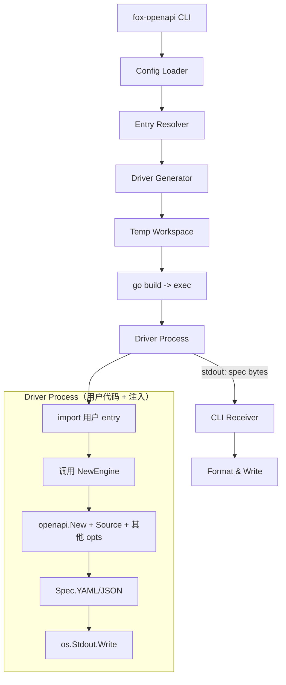

# Fox OpenAPI — 设计与 CLI 实现交接文档

> 状态：library 已实现 Phase 1+2 作为内部反射载体；CLI 已实现为生产推荐方向
> 版本：v0.9（统一 go run → go build+exec 表述、§1.3 改顶层 tag registry、§8.1 API 稳定声明与新增 option 对齐、TODO 6 二选一并更新 driver 模板）
> 日期：2026-05-04
> 接收方注意：本文档面向**没有当前会话上下文**的实现者（人或 AI）。所有背景、目标、决策、陷阱、验收标准都写在此文档内，不需要回看会话历史。

---

## 0. 阅读指引

| 你是谁 | 应先读 |
|---|---|
| 第一次接手 CLI 实现的工程师 | §1 → §2 → §3 → §4 → §5 → §10 |
| 想理解反射 / spec 生成内部机制 | §6 → §7 → §8 |
| 评审本设计的 reviewer | §1 → §3 → §13 |
| 排查实现中的问题 | §10 → §13 → §14 |

强烈建议动手前**通读一遍全文**，CLI 的许多细节互相牵连（driver 文件生成、模块路径解析、entry point 选择）。

---

## 1. 背景与方向

### 1.1 Fox 框架是什么

Fox 是基于 Gin 二次封装的 Go Web 框架（module `github.com/fox-gonic/fox`），核心特性：

- handler 签名固定为反射风格：`func(ctx *fox.Context, args S) (T, error)`（也允许 `func(ctx)` / `func(ctx) T` / `func(ctx) error` 等几种简化变体）
- 框架运行期通过 `reflect` 自动绑定请求参数（`uri` / `query` / `header` / `json` / `form` tag）
- 自动渲染返回值，错误模型统一走 `httperrors.Error`

正因为签名信息丰富，框架在运行期就持有生成 OpenAPI 所需的几乎全部反射信息。

### 1.2 现状

仓库 `openapi/` 子目录是独立 Go module `github.com/fox-gonic/fox-openapi`（用 `replace` 指向本地路径），已实现：

- 从 `*fox.Engine` 的运行期路由表生成 OpenAPI 3.0.3 spec
- path/query/header/body 参数推断
- `binding` validator tag → OpenAPI 约束映射
- `Source(paths, opts)` 从 Go 源码注释补充 summary / description / field doc
- `Operation` / `Group` / `Server` / `SecurityScheme` 等 functional option API
- `httperrors.Error` 自动映射为默认错误响应
- spec endpoint 挂载（`/openapi.yaml`、`/openapi.json`）

### 1.3 路线选择：CLI 为主，library 为内部依赖

经过对 library / Hybrid CLI 两种路线的对比，**正式确定以 CLI 作为生产推荐方向**。

| 方案 | 定位 | 是否继续维护 |
|---|---|---|
| `fox-openapi` library（运行期反射 + 端点挂载） | dev-time 便利方案 + CLI 内部反射载体 | 是，但仅修必要 bug，新功能不在 library 上扩展 |
| `fox-openapi` CLI（独立工具，构建期产出 YAML） | **生产推荐方向**：CI 落地 spec 制品 | 是，新功能在此演进 |

**为什么改 CLI**：

1. **零业务侵入（基础场景）**：业务代码不需要 import openapi 包、不需要在 main 中 `openapi.New(...)` / `Mount(...)`
2. **零运行期开销**：spec 在 CI 中生成，不进入业务进程的内存与启动路径
3. **可纳入版本控制**：`api/openapi.yaml` 作为 PR 的 review 对象，破坏性变更显式可见
4. **复用现有 library 反射逻辑**：CLI 在 driver 子进程中调用 library，不重写一遍

**"零侵入"的边界（重要）**：

CLI 只能透传**可序列化的元数据**——`Info`、`Server`、`Source`、`IncludeTestFiles`、顶层 tag registry、`SecurityScheme`（基础类型）这些通过 YAML 配置即可表达（其中 `info.description` / `servers[].description` / 顶层 `tags` 描述类字段当前 library option 尚未覆盖，详见 §10 TODO 6）。而以下 option 涉及 Go 类型、`reflect.Type`、`*openapi3.Schema` 等运行期对象，**无法用配置文件表达**：

| Option | 为什么不能纯 YAML 化 |
|---|---|
| `RegisterFormatter(reflect.Type, *openapi3.Schema)` | 需要 Go 类型与 openapi3 schema 对象 |
| `SetErrorSchema(body any)` | 需要 Go 类型实例 |
| `Operation(method, path, Response(status, body any, ...))` | response body 是 Go 类型 |
| 复杂的 `SecurityScheme` 自定义 flow | 嵌套对象较多，YAML 表达冗长 |

**首版策略：双轨制**

1. **基础元数据**走 CLI config（`fox-openapi.yaml`）：`info`、`servers`、`sources`、`securitySchemes`（标准 HTTP / API key / OAuth2 三种）、`tags`
2. **高级元数据**走"可选的 metadata hook 函数"：用户可在自己代码里写一个**可选**的导出函数，例如 `func ConfigureOpenAPI() []openapi.Option`，在 CLI config 中通过 `metadataHook: github.com/acme/myapp/internal/server.ConfigureOpenAPI` 指向它。CLI driver 检测到该配置后，把 hook 返回的 option 一并 apply

```yaml
# fox-openapi.yaml
entry: github.com/acme/myapp/internal/server.NewEngine
metadataHook: github.com/acme/myapp/internal/server.ConfigureOpenAPI  # 可选
```

```go
// 用户代码（与业务路由分离的小文件）
package server

import (
    "reflect"
    openapi "github.com/fox-gonic/fox-openapi"
    "github.com/getkin/kin-openapi/openapi3"
    "github.com/shopspring/decimal"
)

func ConfigureOpenAPI() []openapi.Option {
    return []openapi.Option{
        openapi.RegisterFormatter(reflect.TypeOf(decimal.Decimal{}),
            openapi3.NewStringSchema().WithFormat("decimal")),
        openapi.SetErrorSchema(MyError{}),
        openapi.Operation("POST", "/users",
            openapi.Response(201, &User{}, "Created"),
        ),
    }
}
```

**评价**：

- 基础场景完全 0 侵入（不用写 hook）
- 高级场景需要写一个**和路由注册分离**的小函数，但比"在 main 里 `openapi.New(...)`"轻得多——文件可单独存在，且不影响业务进程
- 比起把这些能力硬塞进 YAML，hook 方案保留了 Go 类型安全与 IDE 补全

**library 兼容性**：library 尚未在生产项目中使用，CLI 化过程中如有 API 调整不需要保证向后兼容。

### 1.4 关键决策记录

| 决策点 | 选择 | 拒绝的方案 | 理由 |
|---|---|---|---|
| 走静态 AST 分析（类似 swag） vs 复用 library 的运行期反射 | **运行期反射（Hybrid CLI）** | 纯静态分析 | fox 支持动态注册路由、handler dressing、非字面量路径，纯静态分析会大量误判 |
| 怎么"运行" | **生成临时 driver `main.go`，先 `go build` 再执行二进制，捕获 stdout** | 在 CLI 进程内 `import` 用户包；或一步 `go run` | Go 不支持运行期加载用户代码；`go run` 无法可靠区分编译失败与运行时崩溃 |
| Driver 怎么找入口 | 用户在配置或命令行指定一个**返回 `*fox.Engine` 的导出函数**，如 `internal/server.NewEngine` | 自动发现 main 函数 | main 函数往往启动监听、读配置、连数据库；CLI 不希望产生副作用 |
| 是否要支持 `*DomainEngine` | **暂不支持**，首版只支持单 engine | — | YAGNI，可在第二版加 |
| Library 的 `New(engine, opts...)` 接口要不要保留 | **保留作为 dev-time 工具**，但 CLI 在新功能上演进 | 删除 library | library 内部仍是反射的实现载体；CLI 是其上层调度器 |

### 1.5 设计原则

1. **零侵入优先**：基础 spec 不要求修改任何现存代码，所有元数据补充都是可选的
2. **运行期反射，不做 codegen**：与 fox 既有架构一致；避免引入额外构建步骤
3. **显式优于隐式**：能从代码可靠推断的字段才自动填充；推断不确定时留空
4. **可分层覆盖**：自动推断 → 注释元数据 → handler 元数据 → group 元数据 → 全局默认，后者可被前者覆盖
5. **错误优雅降级**：遇到无法反射的类型（`any`、`interface{}`、循环引用）输出 `additionalProperties: true` 并记录警告，不阻断生成

---

## 2. 用户故事

### 2.1 主流程

```bash
# 在用户项目根目录
$ fox-openapi generate \
    --entry github.com/acme/myapp/internal/server.NewEngine \
    --out api/openapi.yaml

✓ Resolved entry: github.com/acme/myapp/internal/server.NewEngine
✓ Generated driver in .fox-openapi/driver/main.go
✓ Built and ran driver (1.4s)
✓ Wrote api/openapi.yaml (47 paths, 23 schemas, 0 warnings)
```

### 2.2 配置文件

允许把参数固化到 `fox-openapi.yaml`（项目根目录），然后 `fox-openapi generate` 不带参数即可：

```yaml
# fox-openapi.yaml — 完整 schema 示例

# 必填
entry: github.com/acme/myapp/internal/server.NewEngine

# 输出
out: api/openapi.yaml
format: yaml                # yaml | json；默认从 out 后缀推断

# 注释提取
sources:
  - ./...
includeTestFiles: false

# OpenAPI Info
info:
  title: Acme API
  version: 1.0.0
  description: |            # 可选
    Multi-line description.

# OpenAPI servers
servers:
  - url: https://api.acme.com
    description: production # 可选
  - url: https://staging.api.acme.com

# 全局 tag registry（OpenAPI tags 节）
# 仅作为 spec 顶层 tags 元信息（描述、外链）；与 operation 上的 tag 引用解耦。
# operation 自身的 tag 标注通过 metadataHook 中的 openapi.Tags(...) 完成。
tags:
  - name: users
    description: User management endpoints
  - name: billing
    description: Billing & invoicing
    externalDocs:
      url: https://docs.acme.com/billing
      description: Billing guide

# 标准 SecurityScheme（HTTP basic / bearer / apiKey / oauth2 四种 flow）
# 自定义 / 复杂场景请用 metadataHook 调用 openapi.SecurityScheme(...)
securitySchemes:
  BearerAuth:
    type: http
    scheme: bearer
    bearerFormat: JWT
    description: JWT bearer token
  ApiKeyAuth:
    type: apiKey
    in: header
    name: X-API-Key

# 高级元数据 hook（可选）
# 详见 §1.3：用于 RegisterFormatter / SetErrorSchema / Operation(Response with Go types)
metadataHook: github.com/acme/myapp/internal/server.ConfigureOpenAPI

# 模块依赖自动添加（可选；不开启时检测到缺失会退出 1）
autoAdd: false
```

**关于 tags 的语义边界**：
- 配置文件 `tags` 节 **= OpenAPI 顶层 `tags`**，仅描述 tag 元信息（名称、描述、外链）
- **operation 级的 `tags` 引用**（"这个接口属于哪些 tag"）必须通过 metadataHook 中 `openapi.Operation("POST", "/users", openapi.Tags("users"))` 表达，因为它需要按路由匹配
- group 级 tag（一批路由共用一组 tag）通过 metadataHook 中 `openapi.Group("/api/v1", openapi.Tags("v1"))` 表达
- **首版不在 YAML 里支持 operation/group tag 引用**，避免和 hook 形成两套互相覆盖的入口

CLI 优先读命令行参数，否则读配置文件，否则使用默认值。

### 2.3 CI 集成

```yaml
# .github/workflows/openapi.yml
- name: Generate OpenAPI spec
  run: |
    go install github.com/fox-gonic/fox-openapi/cmd/fox-openapi@latest
    fox-openapi generate
- name: Verify spec is up to date
  run: git diff --exit-code api/openapi.yaml
```

第二步在 spec 与代码不一致时让 CI 失败，强制开发者把 spec 一起提交。

### 2.4 dev-time check 模式（次要）

```bash
$ fox-openapi check
api/openapi.yaml is out of date. Run `fox-openapi generate` to refresh.
exit code: 4
```

---

## 3. CLI 命令面

### 3.1 二进制与位置

`fox-openapi`，主入口位于 `cmd/fox-openapi/main.go`（在 `fox-openapi` module 下，与 library 同 module）。

### 3.2 子命令

| 命令 | 功能 |
|---|---|
| `fox-openapi generate` | 生成 spec 并写到 `--out` |
| `fox-openapi check` | 生成到临时文件并 diff `--out`；不一致时退出码 4 |
| `fox-openapi serve` | 本地起 HTTP 服务，预览 spec 与内嵌 UI（Swagger UI / Scalar / Redoc）；支持文件变化自动重新生成 |
| `fox-openapi version` | 打印版本与 commit |

### 3.3 全局 flags

| flag | 默认值 | 说明 |
|---|---|---|
| `--config` | `./fox-openapi.yaml` | 配置文件路径，不存在不报错 |
| `--entry` | （无） | 形如 `module/path/pkg.FuncName`；必须导出且签名为 `func() *fox.Engine` 或 `func() (*fox.Engine, error)` |
| `--out` | `api/openapi.yaml` | 产物路径 |
| `--format` | 由 `--out` 后缀推断 | `yaml` 或 `json` |
| `--source` | `./...`（可重复） | 传给 library `Source()` 的路径列表 |
| `--include-test-files` | `false` | 透传 `IncludeTestFiles()` |
| `--metadata-hook` | （无） | 形如 `module/path/pkg.FuncName`；可选；签名必须为 `func() []openapi.Option`。详见 §1.3 |
| `--auto-add` | `false` | 用户 `go.mod` 缺少 `fox-openapi` require 时，自动执行 `go get github.com/fox-gonic/fox-openapi@<cliVersion>`。会修改用户 `go.mod` / `go.sum`，需明确开启 |
| `--workdir` | 当前目录 | 用户项目根目录（含 `go.mod`） |
| `--keep-driver` | `false` | 保留临时 driver 目录用于排查 |
| `--verbose` | `false` | 打印执行细节 |

> 解析时机：`--metadata-hook` 仅在 CLI flag 或 config 文件显式指定时才被 entry resolver 加载；不存在时静默跳过，**不做 happy path 自动发现**。

### 3.4 serve 子命令的额外 flags

| flag | 默认值 | 说明 |
|---|---|---|
| `--addr` | `127.0.0.1:8765` | HTTP 监听地址 |
| `--ui` | `swagger`（可重复） | 内嵌的 UI；可选 `swagger` / `scalar` / `redoc`；多个 UI 同时挂载在不同路径 |
| `--watch` | `true` | 监听 entry 包及 `--source` 路径下 `.go` 文件变化，自动重新跑 driver 刷新 spec |
| `--open` | `false` | 启动后用系统默认浏览器打开主 UI 路径 |

### 3.5 退出码

| 退出码 | 含义 |
|---|---|
| 0 | 成功 |
| 1 | 用法错误（参数缺失、配置非法、entry 找不到） |
| 2 | 用户代码编译失败 |
| 3 | driver 运行时崩溃 |
| 4 | check 模式发现 drift |
| 5 | 写文件失败 |

---

## 4. 整体架构



**Driver 进程是整个方案的关键**：CLI **临时生成**一个 Go 程序作为子进程运行。它 import 用户的 entry 包，调用 entry 函数拿到 `*fox.Engine`，再调用 library 的 `openapi.New(...)` 生成 spec，把字节流写到 stdout。CLI 父进程读 stdout 即可。

---

## 5. CLI 实现细节

### 5.1 Driver 模板

```go
// Code generated by fox-openapi. DO NOT EDIT.
package main

import (
    "fmt"
    "os"

    "github.com/fox-gonic/fox-openapi"

    userentry "{{.EntryImportPath}}"
    {{if .HookImportPath}}userhook "{{.HookImportPath}}"{{end}}
)

func main() {
    engine{{if .EntryReturnsError}}, err{{end}} := userentry.{{.EntryFuncName}}()
    {{if .EntryReturnsError}}
    if err != nil {
        fmt.Fprintf(os.Stderr, "entry returned error: %v\n", err)
        os.Exit(1)
    }
    {{end}}

    opts := []openapi.Option{
        {{range .InfoOpts}}{{.}},
        {{end}}
        {{range .ServerOpts}}{{.}},
        {{end}}
        {{if .SourcePaths}}
        openapi.Source(
            []string{ {{range .SourcePaths}}{{printf "%q" .}}, {{end}} },
            {{if .IncludeTestFiles}}openapi.IncludeTestFiles(),{{end}}
        ),
        {{end}}
    }
    {{if .HookImportPath}}
    opts = append(opts, userhook.{{.HookFuncName}}()...)
    {{end}}

    g := openapi.New(engine, opts...)

    // 顶层 metadata 后处理（描述类字段直接打到 *openapi3.T；详见 §10 TODO 6）
    spec := g.Spec()
    {{if .InfoDescription}}spec.Info.Description = {{printf "%q" .InfoDescription}}{{end}}
    {{range .ServerDescriptions}}{{.}}    // spec.Servers[i].Description = "..."
    {{end}}
    {{if .TopLevelTags}}spec.Tags = openapi3.Tags{ {{range .TopLevelTags}}{{.}},{{end}} }{{end}}

    var (
        out []byte
        err2 error
    )
    {{if eq .Format "json"}}
    out, err2 = marshalJSON(spec)
    {{else}}
    out, err2 = marshalYAML(spec)
    {{end}}
    if err2 != nil {
        fmt.Fprintf(os.Stderr, "generate spec: %v\n", err2)
        os.Exit(1)
    }

    for _, w := range g.Warnings() {
        fmt.Fprintln(os.Stderr, "WARN:", w)
    }

    if _, err := os.Stdout.Write(out); err != nil {
        fmt.Fprintf(os.Stderr, "write stdout: %v\n", err)
        os.Exit(1)
    }
}
```

### 5.2 临时工作区布局

**最终方案：driver 是用户 module 内部的一个临时 main 包，不创建独立 module。**

```
<workdir>/                  # 用户项目根（含 go.mod）
└── .fox-openapi/
    └── driver/
        └── main.go         # 由 CLI 渲染生成；package main
```

driver 的 import path 解析规则、`internal/` 可见性规则、`replace` 指令、`go.work`、vendor，都自动**继承用户 module**——CLI 不需要复制 / 改写 `go.mod`。

执行（伪代码；完整实现见 §5.5）：

```go
// 阶段 1：编译
buildCmd := exec.Command("go", "build", "-o", "driver.bin", ".")
buildCmd.Dir = filepath.Join(workdir, ".fox-openapi", "driver")
// build 失败 → 退出码 2

// 阶段 2：执行
runCmd := exec.Command(filepath.Join(buildCmd.Dir, "driver.bin"))
runCmd.Dir = buildCmd.Dir
// 运行失败 / panic → 退出码 3
```

**为什么不做独立 module（之前文档里的方案）**：

1. **Go `internal/` 包规则**：`internal` 包只允许同一 module 内部 import。如果 driver 是独立 module（哪怕用 `replace` 指回用户项目），`import "github.com/acme/myapp/internal/server"` 会被编译器拒绝。这是 happy path 的硬阻断——而 `internal/server.NewEngine` 是非常常见的实战写法。
2. 不需要复制和重写 `replace` 指令、不需要处理相对路径 rebase、不需要担心 `go.work` 不可见——这些复杂性全部消失。
3. driver 加上 `// +build ignore` 或文件名带 `_driver`？不需要——`.fox-openapi/` 加进 `.gitignore` 即可，不会被 `go build ./...` 选中（它在隐藏目录下不会被通配命中）；如果用户显式 `go build ./.fox-openapi/...` 也只是把 driver 编译一次，无副作用。

**对用户 module 的唯一要求**：用户 `go.mod` 必须 `require github.com/fox-gonic/fox-openapi`，否则 driver 编不过。

CLI 第一次运行时检查：

- 若 `go list -m github.com/fox-gonic/fox-openapi` 返回非空 → ok
- 否则提示用户运行 `go get github.com/fox-gonic/fox-openapi@<cliVersion>`，或加 `--auto-add` 让 CLI 自动跑这条命令（修改用户 go.mod / go.sum，需要明确同意）

**Source 路径处理**：driver 渲染时把 `--source` 路径转成相对 `cmd.Dir` 的绝对路径（或保留用户原样并由 driver 内 `os.Chdir` 切回 `workdir`）。推荐**用绝对路径**，避免 chdir 引入隐式状态。

**清理**：成功结束后删除 `.fox-openapi/driver/`；`--keep-driver` 时保留。建议项目级 `.gitignore` 加上 `/.fox-openapi/`（CLI 首次运行可主动 append，需明确提示用户）。

### 5.3 Config Loader

- 复用 library 已使用的 `github.com/goccy/go-yaml`
- 优先级：CLI flag > config 文件 > 默认值
- 配置文件不存在时静默用默认值；`--config` 显式指定但不存在则报错

### 5.4 Entry Resolver

输入示例：`github.com/acme/myapp/internal/server.NewEngine`

步骤：

1. 拆分为 `importPath = github.com/acme/myapp/internal/server`，`funcName = NewEngine`
2. 用 `golang.org/x/tools/go/packages` 加载 `importPath`，`Mode = NeedTypes | NeedSyntax | NeedTypesInfo`
3. 在包的 `Scope()` 找名为 `funcName` 的对象，必须是 `*types.Func` 且导出
4. 检查签名：
   - `func() *fox.Engine` ✓
   - `func() (*fox.Engine, error)` ✓
   - 其他 → 报错退出 1
5. 输出 `EntryImportPath` / `EntryFuncName` / `EntryReturnsError` 给 driver 模板

> **怎么判断返回类型是 `*fox.Engine`**：检查 result type 是 `*types.Pointer`，其 elem 是 `*types.Named`，名称为 `Engine` 且属于 fox module。即对 `Named.Obj().Pkg().Path() == "github.com/fox-gonic/fox"` 做匹配。注意用户可能 vendor 了 fox，此时 path 不同——首版可放宽为只匹配 `Pkg().Name() == "fox"` && type name == "Engine"，并在 verbose 模式打印 warning。

### 5.5 Driver 执行

为了**可靠区分编译失败（退出 2）与运行时崩溃（退出 3）**，分两步执行——先 `go build` 再 exec 产物，而不是一步 `go run`：

```go
func runDriver(driverDir string) ([]byte, error) {
    // 阶段 1：编译
    binPath := filepath.Join(driverDir, "driver.bin") // .gitignore 已忽略
    buildCmd := exec.Command("go", "build", "-o", binPath, ".")
    buildCmd.Dir = driverDir
    var buildErr bytes.Buffer
    buildCmd.Stderr = &buildErr
    if err := buildCmd.Run(); err != nil {
        return nil, &driverError{phase: phaseBuild, exitCode: 2, stderr: buildErr.String(), cause: err}
    }
    defer os.Remove(binPath)

    // 阶段 2：执行
    runCmd := exec.Command(binPath)
    runCmd.Dir = driverDir
    var stdout, stderr bytes.Buffer
    runCmd.Stdout = &stdout
    runCmd.Stderr = &stderr
    if err := runCmd.Run(); err != nil {
        return nil, &driverError{phase: phaseRun, exitCode: 3, stderr: stderr.String(), cause: err}
    }
    forwardWarnings(stderr.String())
    return stdout.Bytes(), nil
}
```

注意：
- **不要用 `go run`**：`go run` 把编译错误、运行 panic、用户 `os.Exit(1)` 都映射成同一个非零退出码，无法可靠区分退出 2 / 退出 3
- `cmd.Dir` 指向 driver 子目录即可，因为 driver 不是独立 module，Go 工具链会从该目录向上查找 `go.mod`，自动找到用户 module 根
- driver 的 stderr 用作 warning / 错误通道，stdout 严格只放 spec 字节
- 一般继承用户环境（含 `GOFLAGS`、`GOPROXY` 等）
- 编译产物 `driver.bin` 在 defer 中清理；`--keep-driver` 模式下不删除以便人工调试

### 5.6 Format & Write

- `--out` 父目录不存在时自动创建（`os.MkdirAll`）
- 写入用临时文件 + rename，避免 spec 写到一半 CI 读到部分内容
- check 模式：写到内存 buffer，与 `--out` 内容做字节比较；不一致退出 4

### 5.7 包结构

```
openapi/                            # 既有 library module
├── go.mod
├── openapi.go                      # 反射核心
├── ...                             # 其它 library 反射逻辑
├── cmd/
│   └── fox-openapi/
│       └── main.go                 # CLI entry，cobra 或 flag.NewFlagSet
└── internal/
    └── cli/
        ├── config.go               # Config struct + loader
        ├── resolve.go              # Entry resolver（go/packages）
        ├── driver.go               # 模板渲染 + 临时目录管理
        ├── modcheck.go             # 检测用户 go.mod 是否 require fox-openapi
        ├── runner.go               # go build + exec + 输出捕获
        ├── writer.go               # 原子写入 + check diff
        ├── templates/
        │   └── driver.go.tmpl
        └── cli_test.go
```

CLI 与 library 在**同一 module**：CLI 直接 `import "github.com/fox-gonic/fox-openapi"` 复用 generator；driver 模板里 import 的也是这个 module。

### 5.8 Entry 函数的约定（用户文档示例）

```go
// internal/server/server.go
package server

import "github.com/fox-gonic/fox"

// NewEngine constructs the HTTP engine with all routes registered.
// fox-openapi CLI uses this as its entry. It must:
//   1. Register all routes you want documented
//   2. NOT start listening (no engine.Run)
//   3. NOT depend on external services (DB, cache, etc.) at construction time
func NewEngine() *fox.Engine {
    e := fox.New()
    registerRoutes(e)
    return e
}
```

如果用户的 main 把"注册路由"和"连数据库"耦合在一起，要建议他重构出无副作用的 `NewEngine`。

---

## 6. Library 内部反射机制（CLI 在 driver 进程中调用）

以下是 library 已实现的反射逻辑——CLI 不需要重写，但实现者需要理解，以便排查为什么生成的 spec 长这样。

### 6.1 Route Walker

`gin.Engine.Routes()` 返回 `[]gin.RouteInfo`，但 fox 的 handler 被 `handleWrapper` 包成 `gin.HandlerFunc`，原 handler 的 `reflect.Value` 已丢失。

**解决**：fox core 在 `routergroup.go` 的 `Handle` 中，把原 `handler` 注册到 `engine.handlerRoutes`：

```go
type RouteInfo struct {
    Method      string
    Path        string
    Handler     HandlerFunc
    HandlerType reflect.Type
    HandlerName string
}
func (engine *Engine) HandlerRoutes() []RouteInfo
```

这是 fox core 的**唯一侵入式改动**。可通过 `engine.DisableRouteRegistry()` 关闭采集（CLI 一次性使用，不需要调用此方法）。

路径转换规则：
- gin path `:id` → OpenAPI `{id}`
- gin wildcard `*filepath` → `{filepath}`
- `uri:"id"` 字段必须能匹配路径参数；不一致生成 warning
- 当 handler 没有对应 `uri` 入参时，从路由占位符补充 `string` 类型 path parameter

### 6.2 Handler 反射切入点

handler 已被 `IsValidHandlerFunc` 验证，签名固定为以下五类之一：

```
1. func()
2. func(ctx *Context) T
3. func(ctx *Context) (T, error)
4. func(ctx *Context, args S) T
5. func(ctx *Context, args S) (T, error)
```

OpenAPI 生成只关心：

- **入参定位**：当 `numIn == 2` 时，`handlerType.In(1)` 即业务入参 struct（可能是指针）
- **返回类型定位**：当 `numOut >= 1` 时，`handlerType.Out(0)` 即响应类型；若是 `error` 接口或 `nil`，认为无响应体
- **handler 唯一标识**：用 `runtime.FuncForPC(funcValue.Pointer()).Name()` 作为 `operationId` 默认值（library 内部 `cleanHandlerName` 会去掉 `-fm` / `.funcN` 后缀）

### 6.3 入参字段分类

| Tag 优先级 | 归属 | 备注 |
|---|---|---|
| `uri:"x"` | path parameter（`required: true`） | 与路径占位符 `:x` 校对 |
| `query:"x"` | query parameter | |
| `header:"x"` | header parameter | |
| `context:"x"` | **跳过** | 由 `ctx.Get` 注入，非客户端可控 |
| 其他 | request body 字段 | 按 `Content-Type` 选择 schema 名 |

请求体的 `Content-Type` 推断顺序：

1. 字段是否带 `form` tag → `application/x-www-form-urlencoded`
2. 默认 `application/json`

> **TODO（library 尚未实现）**：未来计划新增 builder API（如 `openapi.RequestBody(contentType, body)`）允许 handler 元数据显式声明 Content-Type；当前 §8.1 的 option 列表暂未提供该能力。

### 6.4 返回类型映射

| handler 返回 | OpenAPI 响应 |
|---|---|
| `T`（具体类型） | `200: { schema: T }` |
| `(T, error)` | `200: T` + 默认错误响应（见 §8） |
| `string` | `200: text/plain` |
| 无返回值 | `200`，无响应体 |
| `error` 单返回 | 仅默认错误响应 |
| `render.Render` / `render.Redirect` | **TODO（library 尚未实现）**：规划中跳过 schema 推断，当前会按普通接口类型处理 |
| `any` / `interface{}` / `map[string]any` | 输出 `additionalProperties: true`。**TODO**：规划中追加 warning，当前静默处理 |

---

## 7. Tag → OpenAPI 映射

### 7.1 字段位置 tag

| 源 tag | OpenAPI 字段 |
|---|---|
| `json:"x,omitempty"` | `properties.x`；是否 required 由 `binding:"required"` 决定 |
| `query:"x"` | `parameters[in=query].name=x` |
| `uri:"x"` | `parameters[in=path].name=x` |
| `header:"x"` | `parameters[in=header].name=x` |
| `form:"x"` | requestBody 的 form schema 字段 |

### 7.2 `binding` 验证 tag

借鉴 `go-playground/validator` 规则集：

| validator 规则 | OpenAPI 约束 |
|---|---|
| `required` | `required: true`（在父 schema 的 `required` 数组） |
| `email` | `format: email` |
| `url` / `uri` | `format: uri` |
| `uuid` / `uuid4` | `format: uuid` |
| `min=N` / `max=N`（数值） | `minimum` / `maximum` |
| `min=N` / `max=N`（字符串） | `minLength` / `maxLength` |
| `len=N` | `minLength == maxLength == N` |
| `gte=N` / `lte=N` | `minimum` / `maximum` |
| `gt=N` / `lt=N` | `exclusiveMinimum` / `exclusiveMaximum` |
| `oneof=a b c` | `enum: [a, b, c]` |
| `numeric` | 由类型保证；忽略 |
| `alphanum` | `pattern: "^[a-zA-Z0-9]+$"` |
| `omitempty` | 不进入 `required` |
| 其他未知规则 | **TODO（library 尚未实现）**：当前静默忽略；规划中改为输出 warning 并写入 `x-fox-binding` 扩展字段 |

### 7.3 类型映射

| Go 类型 | OpenAPI type / format |
|---|---|
| `string` | `string` |
| `bool` | `boolean` |
| `int` / `int32` | `integer` / `int32` |
| `int64` | `integer` / `int64` |
| `float32` / `float64` | `number` / `float` / `double` |
| `time.Time` | `string` / `date-time` |
| `[]byte` | `string` / `byte` |
| `*T` | `T` 但允许 `nullable: true` |
| `[]T` | `array`，`items: T` |
| `map[string]T` | `object`，`additionalProperties: T` |
| 自定义 struct | `$ref: "#/components/schemas/<TypeName>"` |
| 实现 `json.Marshaler` 但非 struct | 输出 `additionalProperties: true`。**TODO（library 尚未实现）**：规划中追加 warning，当前静默处理 |

**命名策略**：`pkg.Type` → `pkg_Type`；同名冲突时第一个保留短名，后来者使用包路径全名 + 输出 warning。

---

## 8. 元数据 API 与错误模型

### 8.1 已实现的 Option 集合（CLI 通过 driver 透传）

```go
package openapi

func New(engine *fox.Engine, opts ...Option) *Generator

// 全局
func Info(title, version string) Option
func Server(url string) Option
func SecurityScheme(name string, scheme *openapi3.SecurityScheme) Option
func HTTPBearerSecurity(description string) *openapi3.SecurityScheme
func RegisterFormatter(typ reflect.Type, schema *openapi3.Schema) Option
func SetErrorSchema(body any) Option

// 分组与单路由
func Group(prefix string, opts ...OperationOption) Option
func Operation(method, path string, opts ...OperationOption) Option

// 单路由 option
func Summary(value string) OperationOption
func Description(value string) OperationOption
func OperationID(value string) OperationOption
func Tags(values ...string) OperationOption
func Deprecated(value bool) OperationOption
func Response(status int, body any, description string) OperationOption
func Security(name string, scopes ...string) OperationOption

// 注释提取
func Source(paths []string, opts ...SourceOption) Option
func IncludeTestFiles() SourceOption

// 输出
func (g *Generator) Spec() *openapi3.T
func (g *Generator) YAML() ([]byte, error)
func (g *Generator) JSON() ([]byte, error)
func (g *Generator) WriteYAML(w io.Writer) error
func (g *Generator) Warnings() []string

// dev-time mount（CLI 不使用）
func Mount(router Router, g *Generator, opts ...MountOption)
func YAMLHandler(g *Generator) fox.HandlerFunc
func JSONHandler(g *Generator) fox.HandlerFunc
```

**这些现有 API 不要改签名**。描述类字段（`info.description` / `servers[].description` / 顶层 `tags`）允许**新增** option（如 `InfoDescription` / `ServerWithDescription` / `Tag(...)`），或选择 driver 后处理路线（详见 §10 TODO 6）；两条路任选其一，不要修改既有 `Info` / `Server` 的签名。如果 CLI 实现过程中发现 library bug，**先在 library 修，CLI 不要绕过**。

### 8.2 注释提取（Source）

`Source` 让反射回答"有什么"，源码注释回答"它是什么意思"：

- handler 函数注释第一段 → operation `summary`
- handler 函数完整注释 → operation `description`
- request / response struct 字段注释 → schema property `description`

实现基于标准库 `go/parser`，可读取普通 `.go` 文件；`IncludeTestFiles()` 时也读 `*_test.go`。

### 8.3 默认错误响应 schema

`httperrors.Error.MarshalJSON` 已经定义了稳定的 JSON 结构。生成器自动注册 `components/schemas/HTTPError`：

```yaml
components:
  schemas:
    HTTPError:
      type: object
      required: [code, error]
      properties:
        code:    { type: string }
        error:   { type: string }
        meta:    { }
      additionalProperties: true
```

凡是返回 `(T, error)` 的 handler，自动添加 `default` 响应指向 `HTTPError`。

如果用户设置了 `engine.RenderErrorFunc`，生成器无法推断真实 schema。当前 library 默认仍用 `HTTPError` 但**不主动发警告**（**TODO**：规划中改为在 spec 顶部加 `x-fox-warning`）。用户可通过 `openapi.SetErrorSchema(myErrorType)` 覆盖。

---

## 9. 依赖

| 候选 | 选用 |
|---|---|
| `github.com/getkin/kin-openapi/openapi3` | ✓ 完整 OpenAPI 3.0/3.1 模型 |
| `github.com/goccy/go-yaml` | ✓ YAML 序列化 + 配置文件解析 |
| `golang.org/x/tools/go/packages` | ✓ Entry resolver |
| `golang.org/x/mod/modfile` | ✓ 解析用户 go.mod 检测 fox-openapi require |
| `github.com/spf13/cobra` 或标准 `flag` | 二选一，建议标准 `flag.NewFlagSet`（无额外依赖） |

---

## 10. CLI 实施 TODO

每项独立可验证，按顺序推进。

### TODO 0：准备 CLI 验收 fixture（前置）

- **目标**：让后续 TODO 1 有真实的 happy path 可跑
- **背景**：当前 `examples/08-openapi/` 是 **library mount 模式**——main 里直接 `openapi.New(engine, ...)` + `openapi.Mount(...)`，业务代码侵入。CLI 验收需要的是无侵入风格，且**没有 `expected.yaml`**
- **交付**：
  - 新增 `examples/09-openapi-cli/` 或改造 `examples/08-openapi/`：
    - 业务代码**不 import** `fox-openapi`
    - 暴露 `func NewEngine() *fox.Engine`（位于 `internal/server/` 或包级目录均可）
    - 路由注册与外部依赖解耦（不连 DB）
    - `main.go` 可保留 `engine.Run`，CLI 不会调用它
  - 把当前 example 期望产物固化为 `expected.yaml`（手工跑一次 generate 后人工 review 入库）
  - 该 fixture 自身的 `go.mod` 通过 local `replace` 指向 `openapi/`（与现有 example 一致）
- **验收**：
  - `cd examples/09-openapi-cli && go build ./...` 通过（业务代码独立可编译）
  - `grep -r fox-openapi examples/09-openapi-cli/` 只命中 `go.mod` 与 `fox-openapi.yaml` 之类配置文件，不命中 `.go` 业务代码
  - `expected.yaml` 入库

### TODO 1：CLI 骨架 + generate 最小路径

- **目标**：`fox-openapi generate --entry pkg.Func` 跑通最简单 case
- **交付**：
  - `cmd/fox-openapi/main.go` 解析参数
  - `internal/cli/cli.go` 串起 config → resolve → driver → run → write
  - `<workdir>/.fox-openapi/driver/` 创建逻辑
  - driver 模板 hardcode 最小版本（不支持 Source / hook）
- **验收**：
  - 在 TODO 0 准备好的 fixture 上运行输出非空 yaml
  - 与 `expected.yaml` 一致（字节级或 YAML 语义级 diff）
  - `--keep-driver` 时目录保留；否则清理

### TODO 2：Config 文件加载

- **目标**：`fox-openapi generate` 不带任何 flag 也能从 `fox-openapi.yaml` 读全部参数
- **交付**：`internal/cli/config.go` + 单测
- **验收**：覆盖矩阵单测（仅 flag / 仅配置 / 都有 flag 优先 / 都没默认值）；`--config` 指定不存在文件时报错；未指定时静默

### TODO 3：Entry Resolver

- **目标**：从 `module/path/pkg.FuncName` 安全解析出 import path、函数名、是否返回 error
- **交付**：`internal/cli/resolve.go`，使用 `golang.org/x/tools/go/packages`
- **验收**：单测覆盖合法 entry / 不存在的包 / 不存在的函数 / 函数签名不匹配 / 函数未导出；错误信息能告诉用户具体哪一步失败、期望签名是什么

### TODO 4：Driver 模板与依赖检测

- **目标**：能在任意用户 module 内生成可编译的 driver
- **交付**：
  - `internal/cli/templates/driver.go.tmpl`
  - `internal/cli/driver.go` 渲染逻辑（写到 `<workdir>/.fox-openapi/driver/main.go`）
  - `internal/cli/modcheck.go` 用 `x/mod/modfile` 解析 `<workdir>/go.mod`，确认 `github.com/fox-gonic/fox-openapi` 已被 require；缺失时给出明确错误（"run `go get github.com/fox-gonic/fox-openapi`"），`--auto-add` 时自行执行
- **验收**：
  - `entry` 指向 `internal/server.NewEngine` 这种 `internal/` 路径的 fixture 上能成功生成（这是关键验收：driver 必须能 import `internal/...`）
  - 用户 `go.mod` 含 `replace` 指令时无需任何额外处理仍可生成
  - 用户未 require fox-openapi 时退出 1 并提示
  - `--keep-driver` 后手动 `cd .fox-openapi/driver && go build .` 也能成功

### TODO 5：Driver 执行与 stderr/stdout 分离

- **目标**：spec 字节走 stdout 干净；warning / 错误走 stderr 转发到 CLI
- **交付**：`internal/cli/runner.go`
- **验收**：driver panic 时 CLI 退出 3，stderr 含 panic 栈；entry 返回 error 时 CLI 退出 3，stderr 含 entry error；`WARN:` 行被前缀化打到 CLI 自身 stderr，不污染输出文件

### TODO 6：Option 透传与 metadata hook

- **目标**：CLI 收到的配置都能反映到最终 spec；高级元数据通过 metadata hook 接入
- **交付**：
  - 扩展 driver 模板，按配置渲染 `Info` / `Server` / `Source` / `IncludeTestFiles` / `SecurityScheme`（HTTP basic / bearer / API key / OAuth2 四种标准 flow）等可序列化 option
  - 渲染 OpenAPI **顶层 tag registry**（`spec.Tags`），而非 operation 级 tag 引用
  - 配置中 `metadataHook` 字段（形如 `pkg.Func`，签名 `func() []openapi.Option`）：driver 模板渲染时把它 import 并展开到 `opts...`
  - entry resolver 支持解析 hook 函数（与 entry 同套机制）
- **library 能力缺口（必须先补，否则配置无法落地）— 实施前请二选一并在 PR 中明确**：
  - **路线 A：新增 library option**
    - `info.description`：新增 `openapi.InfoDescription(string)`（或将 `Info` 扩展为可变参 option）
    - `servers[].description`：新增 `openapi.ServerWithDescription(url, desc)`（或类似）
    - 顶层 `tags` / `externalDocs`：新增 `openapi.Tag(name, opts...)` 写入顶层 `spec.Tags`（注意当前 `openapi.Tags(...)` 是 operation 级，**不动它**，新加一个不同名的 option）
    - driver 模板按现有 `Info` / `Server` 同样的方式 append 这些新 option
  - **路线 B：driver 内后处理 `*openapi3.T`**（推荐，无需扩库 API）
    - library 仅负责生成核心 spec；driver 调用 `spec := g.Spec()` 拿到 `*openapi3.T` 指针
    - driver 直接写：`spec.Info.Description = ...` / `spec.Servers[i].Description = ...` / `spec.Tags = openapi3.Tags{...}`
    - 然后用 kin-openapi 自带的 marshaller 序列化（**不要再走 `g.YAML()` / `g.JSON()`**，否则会再跑一遍生成流程）
    - driver 模板伪代码示意见 §5.1
  - 两条路二选一即可；首版倾向路线 B（最小化 library 改动，把"描述类元信息"明确归口到 CLI 后处理层）
- **验收**：
  - `info: { title: Acme, description: "..." }` → 生成 yaml 同时含 `info.title` 与 `info.description`
  - `servers: [{ url, description }]` → spec `servers[0]` 同时含两个字段
  - `tags: [{ name, description, externalDocs }]` → 生成 yaml 顶层 `tags` 节完整
  - source 配置生效（handler 注释出现在 operation summary 中）
  - `metadataHook` 中 `RegisterFormatter(decimal.Decimal{}, ...)` 能让该类型的字段在 spec 中按指定 schema 输出
  - hook 缺失时不报错，仅基础元数据生效

### TODO 7：原子写入 + 目录创建

- **目标**：spec 写入安全
- **交付**：`internal/cli/writer.go`
- **验收**：父目录不存在时自动创建；中途 panic 不留半截目标文件；format 自动从扩展名推断

### TODO 8：check 子命令

- **目标**：`fox-openapi check` 在 spec 与代码不一致时退出 4
- **交付**：subcmd 入口 + diff 逻辑
- **验收**：一致 → 退出 0，stdout 一行 OK；不一致 → 退出 4，stderr 输出"out of date, run generate"；`--out` 文件不存在 → 退出 4

### TODO 9：serve 子命令（本地预览 + 内嵌 UI）

- **目标**：`fox-openapi serve` 起本地 HTTP 服务，提供 spec endpoint 与至少一种内嵌 UI；watch 模式下源码改动自动重新生成
- **交付**：
  - `internal/cli/serve.go` 实现 HTTP server + 路由：
    - `GET /openapi.yaml`、`GET /openapi.json` 返回当前 spec 字节
    - `GET /docs`（Swagger UI，默认）、`GET /scalar`（Scalar）、`GET /redoc`（Redoc）
    - 静态资源用 `embed` 内置（不上网拉 CDN）；HTML 模板里把 spec URL 指向同进程的 `/openapi.yaml`
  - `internal/cli/watcher.go` 用 `github.com/fsnotify/fsnotify` 监听 entry 包目录与 `--source` 路径下 `.go` 文件，去抖 300ms 后重跑 driver
  - 重新生成失败时**不替换**当前内存中 spec，stderr 打印错误，UI 继续展示上一份可用 spec
  - `--open` 时启动后用 `os/exec` 调系统命令打开浏览器（macOS `open`、Linux `xdg-open`、Windows `rundll32`）
  - library 侧需要导出可复用的 UI HTML 渲染函数（或 CLI 直接内置 HTML 模板，二选一；建议 CLI 内置避免污染 library）
- **验收**：
  - `fox-openapi serve --addr :8765 --ui swagger --ui scalar --ui redoc` 启动后 `curl localhost:8765/openapi.yaml` 拿到 spec；浏览器打开 `/docs`、`/scalar`、`/redoc` 都能正常渲染且无外网请求（断网情况下也能用）
  - 修改 handler 注释 → 1 秒内 UI 刷新后看到新 summary
  - 故意写错代码导致编译失败 → server 不挂、UI 显示上一份 spec、CLI stderr 打印编译错误
  - `Ctrl+C` 优雅退出（关闭 listener、停 watcher、清理临时 driver 目录）
  - 端口被占用时退出 1 并给出清晰提示

### TODO 10：端到端测试 + CI

- **目标**：把 TODO 0 的 CLI fixture 接入 GitHub Actions
- **交付**：
  - fixture 目录下 `api/openapi.yaml` 入库（即 `expected.yaml` 的最终位置）
  - `.github/workflows/openapi.yml`
  - `internal/cli/cli_test.go` 端到端：起子进程跑 CLI，断言产物
- **验收**：故意改 handler 签名 → PR diff 命中 yaml 变化；CI workflow 在 main baseline 跑 check 通过

### TODO 11：文档

- **目标**：用户文档 + 迁移指南
- **交付**：
  - `openapi/cmd/fox-openapi/README.md` — quickstart
  - 在本文档追加 CLI 实战 troubleshooting
- **验收**：同事按 README 跑通一次 generate；文档涵盖安装、entry 函数怎么写、CI 集成示例、5 个常见错误

---

## 11. 多域名 / DomainEngine 支持（Future Work）

`DomainEngine` 包含多个独立 `*Engine`。两种输出策略：

- **方案 A（默认）**：每个域名单独一份 spec
  ```
  GET  /openapi.yaml          → 主 engine
  GET  /openapi.yaml?host=api.example.com → 指定域名
  ```
- **方案 B**：合并 spec，使用 `servers` 区分

首版 CLI 不实现。第二版可让 entry 返回 `*DomainEngine`，CLI 输出多份 spec（per-host 文件名）。

---

## 12. UI 集成（serve 子命令必做）

`fox-openapi serve` 是首版必须交付的子命令，目标是让开发者本地一条命令即可获得：

- 当前代码对应的 spec endpoint：`/openapi.yaml`、`/openapi.json`
- 至少 Swagger UI / Scalar / Redoc 三种 UI 中的一种（建议默认 Swagger UI，其他两种通过 `--ui` 同时开启）
- 源码变化自动刷新（默认 watch 模式）

### 12.1 内嵌资源策略

UI 静态资源用 `embed` 打进 CLI 二进制，**不要在 HTML 里 `<script src="https://cdn...">`**。原因：

- 离线环境（公司内网、飞机上）也要可用
- 避免 CDN 失败 / 版本漂移导致 UI 行为不可控
- 服务端版本与前端 UI 版本对齐，减少调试噪声

具体路径建议：

```
internal/cli/ui/
├── ui.go                 # 路由注册：/docs → swagger, /scalar → scalar, /redoc → redoc
├── swagger/              # Swagger UI dist 文件（或单文件 swagger-ui-bundle.js）
├── scalar/
├── redoc/
└── templates/
    ├── swagger.html.tmpl # 引用 /openapi.yaml 作为 spec URL
    ├── scalar.html.tmpl
    └── redoc.html.tmpl
```

### 12.2 watch 行为

- fsnotify 监听 entry 包所在目录及 `--source` 路径下递归的 `.go` 文件
- 单次事件触发后 300ms 去抖，再串行重跑 driver
- 重跑成功 → 替换内存中 spec；失败 → 保留上一份，stderr 打印 cause
- watch 默认 on，`--watch=false` 关闭（CI 中不应该用 serve，但保留这个 flag 便于排查）

### 12.3 与 generate 的关系

serve 内部复用与 generate 相同的 driver pipeline（resolve → driver → run），只是输出端从"写文件"换成"放进 HTTP handler 的内存"。**不要为 serve 重写一套 driver**。把 driver pipeline 抽成 `internal/cli/pipeline.go` 的 `Run(ctx) ([]byte, error)`，generate 和 serve 都调它。

### 12.4 library 侧的 dev-time mount（保留）

library 仍保留以下 API 作为 dev-time 工具，业务代码可以在自己的 main 中挂载（适合本地手工写 `engine.Run` 起服务的场景）：

```go
router.GET("/openapi.yaml", openapi.YAMLHandler(spec))
router.GET("/openapi.json", openapi.JSONHandler(spec))
openapi.Mount(router, spec)
```

但**生产推荐路径仍是 `fox-openapi serve` 而非把 mount 写进业务 main**，原因与 §1.3 一致。

---

## 13. 风险与已知陷阱

| 风险 | 触发场景 | 缓解 |
|---|---|---|
| 用户 entry 函数有副作用（连 DB / 起 goroutine / `os.Exit`） | 非纯函数 entry | 文档警示；考虑加 `--timeout` |
| 用户项目用 vendor | vendor 下没有 fox-openapi 包 | 提示用户 `go mod vendor` 后重跑，或不用 vendor |
| 用户项目用 workspace（`go.work`） | driver 在用户 module 内，工具链自动识别 workspace | 一般无需特殊处理；若 fox-openapi 也在 workspace 中需保证它被 `use` |
| 路由路径包含动态片段 | spec 出现意料之外的 path | library 已照实记录，是用户行为预期 |
| handler 是闭包或方法值 | runtime function name 带 `.func1` / `-fm` 后缀 | library `cleanHandlerName` + `normalizeRuntimeFuncName` 已处理 |
| Windows 路径分隔符 | `filepath.Join` vs `path.Join` 混用 | 一律用 `filepath`；模板里 import path 用 `path` |
| go.sum 校验失败 | 用户 go.sum 缺 fox-openapi entry | 提示用户先 `go mod tidy` 或 CLI 自动跑 `go mod download` |
| 用户 fox 版本与 CLI 期望版本不一致 | API 不兼容 | driver 编译失败；CLI 提示用户升级 fox / fox-openapi |
| 大量 stdout 把 buffer 撑爆 | 极大型 API spec | `cmd.Stdout` 接 `*os.File` 而非内存 buffer |
| handler 返回 `any` | spec 信息缺失 | library 输出 warning 列表；推荐用具体类型 |
| 循环引用 struct | 栈溢出 | library schema cache 在递归前先放占位符 `$ref` |
| 用户 `go build ./...` 选中 driver 文件 | driver 本身可编译，无副作用，但出现在 build 列表里看着别扭 | `.fox-openapi/` 加进 `.gitignore`；隐藏目录通配命中概率低 |

---

## 14. Troubleshooting Cheat Sheet（写进用户文档）

| 错误 | 含义 | 解决 |
|---|---|---|
| `entry function not found: pkg.Func` | resolver 找不到 | 检查 import path 是否在 go.mod 里、函数是否导出 |
| `entry function signature mismatch` | 签名不允许 | 改成 `func() *fox.Engine` 或 `func() (*fox.Engine, error)` |
| `driver build failed` (退出 2) | 用户代码编译错 | 先 `go build ./...` 修复 |
| `entry returned error` (退出 3) | entry 返回 non-nil error | 看 stderr cause |
| `out of date` (退出 4) | check 模式 spec 不一致 | 跑 `fox-openapi generate` 提交 |
| `user module must require github.com/fox-gonic/fox-openapi` | driver 需要在用户 module 中 import library | 运行 `go get github.com/fox-gonic/fox-openapi`，或传 `--auto-add` |
| `missing go.sum entry` | 用户 module 虽然 require 了 fox-openapi，但缺少 transitive checksum | 在用户 module 里运行 `go get github.com/getkin/kin-openapi/openapi3@<version>` 或 `go mod tidy` 后重跑 |
| 输出文件混入日志 | entry 阶段用户代码直接写 stdout | 将用户日志改到 stderr，或从 entry 中移除副作用 |
| serve 修改源码后没刷新 | watcher 未覆盖路径，或编译失败保留上一份 spec | 检查 `sources` 配置，并查看 CLI stderr |

---

## 15. 验收 Checklist（实现完成后逐条勾）

- [ ] `fox-openapi generate` 在 CLI fixture（见 TODO 0）上输出与 `expected.yaml` 一致
- [ ] `fox-openapi check` 在一致 / 不一致两种状态下退出码正确
- [ ] `fox-openapi serve` 起服务后 `/openapi.yaml`、`/docs`、`/scalar`、`/redoc` 全部可访问且离线可用
- [ ] serve watch 模式下改 handler 注释 1 秒内 UI 反映
- [ ] serve 编译失败时不挂、保留旧 spec、stderr 打印 cause
- [ ] 用户项目带 `replace` 指令时仍可生成
- [ ] 用户项目未 require fox-openapi 时 CLI 给出清晰提示
- [ ] driver 临时文件成功后清理，`--keep-driver` 时保留
- [ ] WARN 不污染 spec 输出
- [ ] 端到端测试在 CI 中跑通
- [ ] README 含安装、5 行 quickstart、5 个 troubleshooting

---

## 16. Future Work（不在首版范围）

- `*DomainEngine` 多 engine：entry 可返回 `[]*fox.Engine` 或 `*DomainEngine`，CLI 输出多份 spec
- Spec diff：`fox-openapi diff old.yaml new.yaml` 列破坏性变更
- 增量生成：缓存已解析 schema 加速重复运行
- `fox-openapi lint`：检查命名一致性、缺 description 的 operation
- OpenAPI 3.1 webhooks
- `oneOf` / `anyOf` 支持（接口类型显式声明）

---

## 17. 给实现者的最后建议

1. **先做 happy path**：TODO 1 跑通后再考虑边界情况，不要一开始就处理 vendor / workspace
2. **driver 模板用 `text/template`**，不要拼字符串
3. **entry resolver 出错的提示要带行号**：用户写错 entry 字符串是高频场景
4. **每个 TODO 写完先跑一次 `go test ./internal/cli/...`，再进下一个**
5. **不要在 CLI 里复制 library 已有逻辑**：CLI 的职责只是"把用户代码包起来跑一次"，所有反射和 spec 拼装都在 driver 进程内由 library 完成

祝顺利。
